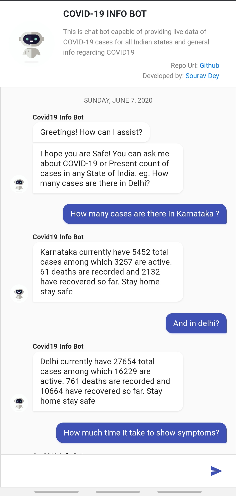
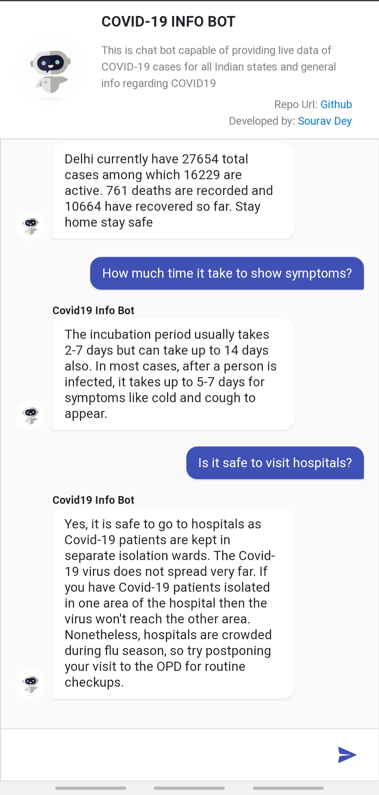

## COVID 19 INFO BOT

### Description

People are in great misconceptions and believing myths regarding COVID 19. So, This bot is a fact machine for everybody.
This infobot is capable of giving the latest data of COVID 19 cases in India and general facts regarding COVID 19.

A chatbot developed with Dialogflow with frontend in ReactJs and webhook in NodeJs and ExpressJs It is a responsive chatbot that is designed to be supported on any device and it is developed considering the Google's concepts of Progressive Web Applications.

	The Above Repo is the Frontend Source Code of the ChatBot in ReactJs

**[Webhook Source Code](https://github.com/Souravdey777/Covid19-InfoBot/)**

### Demo

**[Click here for demo](https://souravdey777.github.io/Covid19-InfoBot_FE/)**
<a href="https://souravdey777.github.io/Covid19-InfoBot_FE/" target="_blank">
	

  		
  		
	

</a>

Youtube Demo

<!--     <iframe width="560" height="315" src="https://www.youtube.com/embed/mMmjEh71ZeY" frameborder="0" allow="accelerometer; autoplay; encrypted-media; gyroscope; picture-in-picture" allowfullscreen></iframe> -->

### Features

	• Capabilities to give live data of Covid 19 count for all states of India.
	• Capabilities to give general info about Covid 19.
	• Dialogflow comes with Google NLP Capabilities.
	• Integration with Slack, Facebook, twitter, etc are possible.
	• Webhook to fetch live data using NodeJs and ExpressJs.
	• Responsive Design
	• Progressive Web Application

### Getting Started

Clone/download the repository on your local machine.

	`git clone https://github.com/Souravdey777/News-Bucket.git`

##### Install dependencies

	`npm install` or `yarn install`

##### Run Snap Shot from the root directory.

	`npm start` or `yarn start`

### Contributing

Everyone is welcomed to contribute to this project. You can contribute either by submitting bugs or suggesting improvements by opening an issue on GitHub.

## Learn More

You can learn more in the [Create React App documentation](https://facebook.github.io/create-react-app/docs/getting-started).

To learn React, check out the [React documentation](https://reactjs.org/).

### Code Splitting

This section has moved here: https://facebook.github.io/create-react-app/docs/code-splitting

### Analyzing the Bundle Size

This section has moved here: https://facebook.github.io/create-react-app/docs/analyzing-the-bundle-size

### Making a Progressive Web App

This section has moved here: https://facebook.github.io/create-react-app/docs/making-a-progressive-web-app

### Advanced Configuration

This section has moved here: https://facebook.github.io/create-react-app/docs/advanced-configuration

### Deployment

This section has moved here: https://facebook.github.io/create-react-app/docs/deployment

### `npm run build` fails to minify

This section has moved here: https://facebook.github.io/create-react-app/docs/troubleshooting#npm-run-build-fails-to-minify
